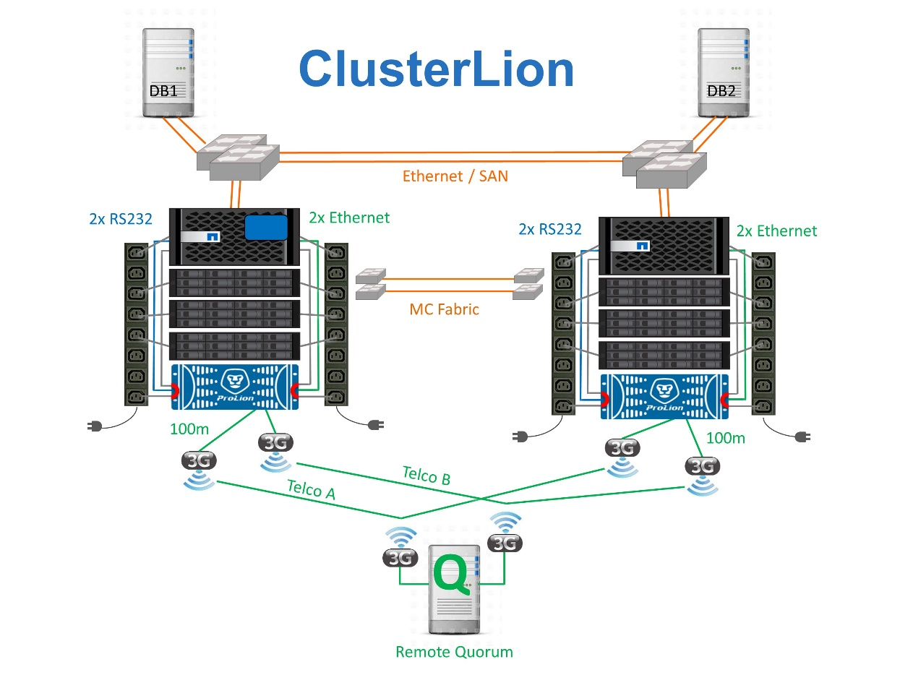

= 站台故障保護： NVRAM 和 MetroCluster
:allow-uri-read: 

== 站台故障保護： NVRAM 和 MetroCluster

MetroCluster 以下列方式擴充 NVRAM 資料保護：

* 在雙節點組態中、 NVRAM 資料會使用交換器間連結（ ISL ）複寫到遠端合作夥伴。
* 在 HA 配對組態中、 NVRAM 資料會同時複寫到本機合作夥伴和遠端合作夥伴。
* 寫入內容必須複寫到所有合作夥伴、才能予以確認。此架構可將 NVRAM 資料複寫至遠端合作夥伴、保護機上 I/O 不受站台故障影響。此程序不涉及磁碟機層級的資料複寫。擁有該集合體的控制器負責將資料複寫至集合體中的兩個叢集、但在站台遺失時仍必須保護資料、避免在執行中遺失 I/O 。只有當合作夥伴控制器必須接管故障控制器時、才會使用複寫的 NVRAM 資料。

== 站台和機櫃故障保護： SyncMirror 和叢

SyncMirror 是一項鏡射技術、可增強但不取代 RAID DP 或 RAID-TEC 。它會鏡射兩個不同 RAID 群組的內容。邏輯組態如下：

. 磁碟機會根據位置設定成兩個集區。一個集區由站台 A 上的所有磁碟機組成、第二個集區由站台 B 上的所有磁碟機組成
. 接著會根據鏡射的 RAID 群組集建立通用儲存池（稱為 Aggregate ）。從每個站台擷取的磁碟機數量相等。例如、 20 個磁碟機的 SyncMirror Aggregate 將由站台 A 的 10 個磁碟機和站台 B 的 10 個磁碟機組成
. 指定站台上的每組磁碟機都會自動設定為一個或多個完全備援的 RAID DP 或 RAID-TEC 群組、而不受鏡像的使用影響。在鏡射下使用 RAID 、即使在站台遺失之後、也能提供資料保護。

image:../media/syncmirror.png["SyncMirror 組態"]

上圖說明 SyncMirror 組態範例。在控制器上建立了 24 個磁碟機的集合體、其中 12 個磁碟機來自於站台 A 上配置的機櫃、 12 個磁碟機來自站台 B 上配置的機櫃磁碟機分為兩個鏡射 RAID 群組。RAID 群組 0 包含站台 A 的 6 磁碟機叢、鏡射到站台 B 的 6 磁碟機叢同樣地、 RAID 群組 1 也包含站台 A 的 6 磁碟叢叢、鏡射到站台 B 的 6 磁碟叢叢

SyncMirror 通常用於提供 MetroCluster 系統的遠端鏡射、每個站台都有一份資料複本。有時候、它是用來在單一系統中提供額外的備援層級。特別是提供機架層級的備援。磁碟機櫃已包含雙電源供應器和控制器、整體上比金屬板稍多、但在某些情況下、可能需要額外的保護。例如、有一位 NetApp 客戶部署 SyncMirror 、用於汽車測試期間使用的行動即時分析平台。系統分為兩個實體機架、分別隨附獨立的電源饋送和獨立的 UPS 系統。

== 備援故障： NVFAIL

如前所述、寫入必須先登入本機 NVRAM 及至少一個其他控制器上的 NVRAM 、才會被確認。此方法可確保硬體故障或停電不會導致機內 I/O 遺失如果本機 NVRAM 故障或連線至其他節點失敗、則資料將不再鏡射。

如果本機 NVRAM 回報錯誤、節點會關機。當使用 HA 配對時、此關機會導致容錯移轉至合作夥伴控制器。使用 MetroCluster 時、行為取決於所選的整體組態、但可能會導致自動容錯移轉至遠端記事。無論如何、由於發生故障的控制器尚未確認寫入作業、因此不會遺失任何資料。

站台對站台連線故障會封鎖 NVRAM 複寫至遠端節點、這種情況更為複雜。寫入不再複寫到遠端節點、因此如果控制器發生災難性錯誤、可能會導致資料遺失。更重要的是、在這些情況下、嘗試容錯移轉至其他節點會導致資料遺失。

控制因素是 NVRAM 是否同步。如果 NVRAM 已同步、則節點對節點容錯移轉可安全地繼續進行、不會有資料遺失的風險。在 MetroCluster 組態中、如果 NVRAM 和基礎 Aggregate plex 同步、則可以安全地繼續進行轉換、而不會有資料遺失的風險。

除非強制進行容錯移轉或切換、否則 ONTAP 不允許在資料不同步時進行容錯移轉或切換。以這種方式強制變更條件、即表示資料可能會留在原始控制器中、而且資料遺失是可以接受的。

如果強制進行容錯移轉或切換、資料庫和其他應用程式尤其容易毀損、因為它們會在磁碟上保留較大的內部資料快取。如果發生強制容錯移轉或切換、先前確認的變更將會有效捨棄。儲存陣列的內容會有效地及時向後跳轉、而且快取狀態不再反映磁碟上資料的狀態。

為了避免這種情況發生、 ONTAP 允許設定磁碟區、以針對 NVRAM 故障提供特殊保護。觸發時、此保護機制會導致磁碟區進入稱為 NVFAIL 的狀態。此狀態會導致 I/O 錯誤、導致應用程式當機。這項當機會導致應用程式關機、使其不使用過時的資料。資料不應遺失、因為記錄中應存在任何已認可的交易資料。通常的後續步驟是讓系統管理員在手動將 LUN 和磁碟區重新上線之前、先完全關閉主機。雖然這些步驟可能涉及一些工作、但這種方法是確保資料完整性的最安全方法。並非所有資料都需要這項保護、因此 NVFAIL 行為可依每個磁碟區設定。

=== HA 配對與 MetroCluster

MetroCluster 提供兩種組態：雙節點和 HA 配對。雙節點組態在 NVRAM 上的運作方式與 HA 配對相同。如果發生突然故障、合作夥伴節點可以重新執行 NVRAM 資料、以確保磁碟機一致、並確保沒有遺失任何已確認的寫入資料。

HA 配對組態也會將 NVRAM 複寫到本機合作夥伴節點。簡單的控制器故障會在合作夥伴節點上重新執行 NVRAM 、而獨立 HA 配對則不使用 MetroCluster 。萬一突然完全遺失站台、遠端站台也需要 NVRAM 、才能讓磁碟機保持一致、開始提供資料。

MetroCluster 的一個重要層面是、在正常作業條件下、遠端節點無法存取合作夥伴資料。每個站台基本上都是一個可假設對方站台特性的個別系統。此程序稱為「轉換」、包含計畫性的轉換、可在不中斷營運的情況下、將站台作業移轉至另一個站台。它也包括站台遺失的非計畫性情況、以及災難恢復需要手動或自動切換。

== 切換與切換

術語切換和切換是指在 MetroCluster 組態中、在遠端控制器之間轉換磁碟區的程序。此程序僅適用於遠端節點。在四個磁碟區組態中使用 MetroCluster 時、本機節點容錯移轉是先前所述的相同接管和恢復程序。

=== 計畫性切換與切換

規劃的切換或切換類似於節點之間的接管或恢復。此程序有多個步驟、可能需要幾分鐘的時間、但實際發生的是儲存設備和網路資源的多階段順暢轉換。控制傳輸的速度比執行完整命令所需的時間快得多。

接管 / 恢復與切換 / 切換回復之間的主要差異在於對 FC SAN 連線能力的影響。使用本機接管 / 恢復功能、主機會遺失通往本機節點的所有 FC 路徑、並仰賴其原生 MPIO 來切換至可用的替代路徑。連接埠不會重新定位。透過切換和切換、控制器上的虛擬 FC 目標連接埠會轉換到另一個站台。它們在 SAN 上實際上已經停用一段時間、然後重新出現在替代控制器上。

=== SyncMirror 逾時

SyncMirror 是一項 ONTAP 鏡射技術、可針對機櫃故障提供保護。當機櫃之間相隔一段距離時、就能獲得遠端資料保護。

SyncMirror 無法提供通用同步鏡像。因此、可用度更高。有些儲存系統使用固定的全或全自動鏡射、有時稱為 Domino 模式。這種形式的鏡像在應用程式中受到限制、因為如果與遠端站台的連線中斷、所有寫入活動都必須停止。否則、寫字會存在於某個站台、但不會存在於另一個站台。一般而言、如果站台對站台連線中斷超過一段短時間（例如 30 秒）、這類環境就會設定為使 LUN 離線。

這種行為是小型環境子集的理想選擇。不過、大多數應用程式都需要一套解決方案、能夠在正常作業條件下提供保證同步複寫、但能夠暫停複寫。站台對站台連線能力完全中斷通常被視為近乎災難的情況。一般而言、這類環境會保持在線上狀態並提供資料、直到連線能力修復或正式決定關閉環境以保護資料為止。純粹因為遠端複寫失敗而需要自動關閉應用程式、這是不尋常的。

SyncMirror 支援同步鏡射需求、並可靈活調整逾時時間。如果與遠端控制器和 / 或叢的連線中斷、 30 秒定時器就會開始倒數。當計數器達到 0 時、會使用本機資料繼續寫入 I/O 處理。資料的遠端複本可以使用、但會在連線恢復之前、及時凍結。重新同步利用 Aggregate 層級快照、將系統儘快恢復至同步模式。

值得注意的是、在許多情況下、這種通用的「全或全無」 Domino 模式複寫功能更適合在應用程式層上實作。例如、 Oracle DataGuard 包括最大保護模式、可在任何情況下保證執行個體的長時間複寫。如果複寫連結失敗超過可設定的逾時時間、資料庫就會關閉。

=== 使用 Fabric 附加 MetroCluster 自動進行無人值守切換

自動無人值守切換（ AUSO ）是一項 Fabric 附加 MetroCluster 功能、可提供一種跨站台 HA 的形式。如前所述、 MetroCluster 有兩種類型：每個站台上只有一個控制器、或每個站台上有一個 HA 配對。HA 選項的主要優點是、計畫性或非計畫性控制器關機仍可讓所有 I/O 成為本機。單一節點選項的優勢在於降低成本、複雜度和基礎架構。

AUSO 的主要價值在於改善 Fabric 附加 MetroCluster 系統的 HA 功能。每個站台都會監控相對站台的健全狀況、如果沒有節點仍可提供資料、 AUSO 就會導致快速的轉換。這種方法在每個站台只有一個節點的 MetroCluster 組態中特別有用、因為在可用度方面、它使組態更接近 HA 配對。

AUSO 無法在 HA 配對層級提供全方位監控。HA 配對可提供極高的可用度、因為它包含兩條備援實體纜線、可用於直接節點對節點通訊。此外、 HA 配對中的兩個節點都能存取備援迴圈上的同一組磁碟、為一個節點提供另一條路由來監控另一個節點的健全狀況。

MetroCluster 叢集存在於站台之間、節點對節點通訊和磁碟存取都仰賴站台對站台網路連線。監控叢集其餘部分的活動訊號的能力有限。AUSO 必須區分其他站台實際停機、而非因為網路問題而無法使用的情況。

因此、如果 HA 配對中的控制器偵測到因特定原因（例如系統異常）而發生的控制器故障、就會提示接管。如果連線完全中斷、也可能會提示接管、有時也稱為「失去心跳」。

只有在原始站台偵測到特定故障時、 MetroCluster 系統才能安全地執行自動切換。此外、擁有儲存系統所有權的控制器必須能夠保證磁碟和 NVRAM 資料同步。控制器無法保證進行變更的安全性、因為它與來源站台失去接觸、而該站台仍可運作。如需將交換作業自動化的其他選項、請參閱下一節中的 MetroCluster tiebreaker （ MCTB ）解決方案資訊。

=== MetroCluster tiebreaker 搭配網路附加 MetroCluster

此link:https://docs.netapp.com/us-en/ontap-metrocluster/install-ip/task_sw_config_configure_mediator.html["NetApp MetroCluster tiebreaker"^]軟體可在第三個站台上執行，以監控 MetroCluster 環境的健全狀況，傳送通知，並在災難情況下強制切換。您可以在上找到link:http://mysupport.netapp.com["NetApp 支援網站"^]有關 tiebreaker 的完整說明，但 MetroCluster tiebreaker 的主要用途是偵測站台遺失。它還必須區分站台遺失和連線中斷。例如、不應因為斷路器無法到達主要站台而進行切入、這就是為什麼斷路器也會監控遠端站台與主要站台聯絡的能力。

與 AUSO 的自動切換功能也相容於 MCTB 。AUSO 反應非常迅速、因為它的設計是偵測特定故障事件、然後只有在 NVRAM 和 SyncMirror 叢同步時才叫用切入。

相反地、斷路器位於遠端位置、因此必須等到定時器結束後才會宣告站台停機。tiebreaker 最終會偵測 AUSO 涵蓋的控制器故障類型、但一般而言、 AUSO 已經開始進行開關作業、而且可能會在 tiebreaker 運作之前完成開關作業。產生的第二個來自 tiebreaker 的切換命令將會遭到拒絕。

CAUTION: 當強制切入時， MCTB 軟體無法驗證 NVRAM 是否與 / 或叢同步。如果已設定自動切換、則應在維護活動期間停用、導致 NVRAM 或 SyncMirror 叢同步中斷。

此外、 MCTB 可能無法因應導致下列事件順序的滾動災難：

. 站台之間的連線中斷超過 30 秒。
. SyncMirror 複寫逾時、且作業會繼續在主要站台上執行、使遠端複本過時。
. 主站台會遺失。結果是主站台上存在未複寫的變更。因此、由於下列幾個原因、可能不希望進行任何一次的重新操作：
+
** 關鍵資料可能會出現在主要站台上、而且該資料最終可能會恢復。允許應用程式繼續作業的轉換作業、將會有效捨棄該關鍵資料。
** 當站台遺失時、使用主要站台上儲存資源的仍在運作中站台上的應用程式可能已快取資料。切入會導致資料的過時版本與快取不相符。
** 當發生站台遺失時、使用主要站台上儲存資源的仍在運作中站台上的作業系統、可能已快取資料。切入會導致資料的過時版本與快取不相符。最安全的選項是將斷路器設定為在偵測到站台故障時傳送警示、然後讓人員決定是否強制進行轉換。應用程式和（或）作業系統可能需要先關機、才能清除任何快取資料。此外、 NVFAIL 設定也可用於新增進一步的保護、並協助簡化容錯移轉程序。

=== ONTAP Mediator 搭配 MetroCluster IP

ONTAP Mediator 可搭配 MetroCluster IP 和某些其他 ONTAP 解決方案使用。它是一項傳統的斷路器服務，就像上述的 MetroCluster tiebreaker 軟體一樣，但也包含一項重要功能，即執行自動無人值守的移除。

光纖連接的 MetroCluster 可直接存取位於相對站台的儲存裝置。這可讓一個 MetroCluster 控制器從磁碟機讀取心跳資料、以監控其他控制器的健全狀況。這可讓一個控制器辨識另一個控制器的故障、並執行切換。

相反地、 MetroCluster IP 架構只會透過控制器控制器連線路由所有 I/O 、而無法直接存取遠端站台上的儲存裝置。這會限制控制器偵測故障和執行轉換的能力。因此、 ONTAP Mediator 必須作為斷路器裝置、才能偵測站台遺失並自動執行轉換。

=== 使用 ClusterLion 的虛擬第三站點

ClusterLion 是一款先進的 MetroCluster 監控設備、可作為虛擬第三站點使用。此方法可讓 MetroCluster 安全部署在雙站台組態中、並具備全自動的轉換功能。此外、 ClusterLion 還能執行額外的網路層級監控、並執行後置作業。完整文件可從 ProLion 取得。

* ClusterLion 設備會使用直接連接的乙太網路和序列纜線來監控控制器的健全狀況。
* 這兩台設備透過備援的 3G 無線連線彼此連線。
* ONTAP 控制器的電源會透過內部中繼路由傳送。發生站台故障時、包含內部 UPS 系統的 ClusterLion 會先切斷電源連線、然後再啟動切入。此程序可確保不會發生任何大腦分割狀況。
* ClusterLion 會在 30 秒 SyncMirror 逾時內執行切換、或完全不執行。
* 除非 NVRAM 和 SyncMirror 叢集的狀態同步、否則 ClusterLion 不會執行切入。
* 由於 ClusterLion 只會在 MetroCluster 完全同步時執行切入、因此不需要 NVFAIL 。此組態可讓擴充 Oracle RAC 等站台跨距環境保持連線、即使在非計畫性的轉換期間亦然。
* 支援包括光纖連接的 MetroCluster 和 MetroCluster IP

