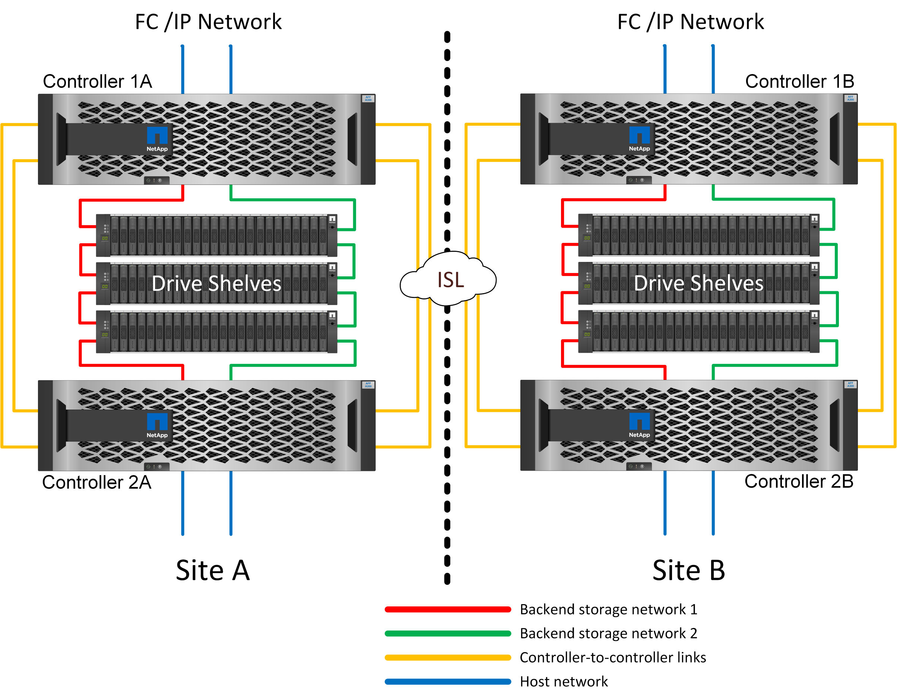
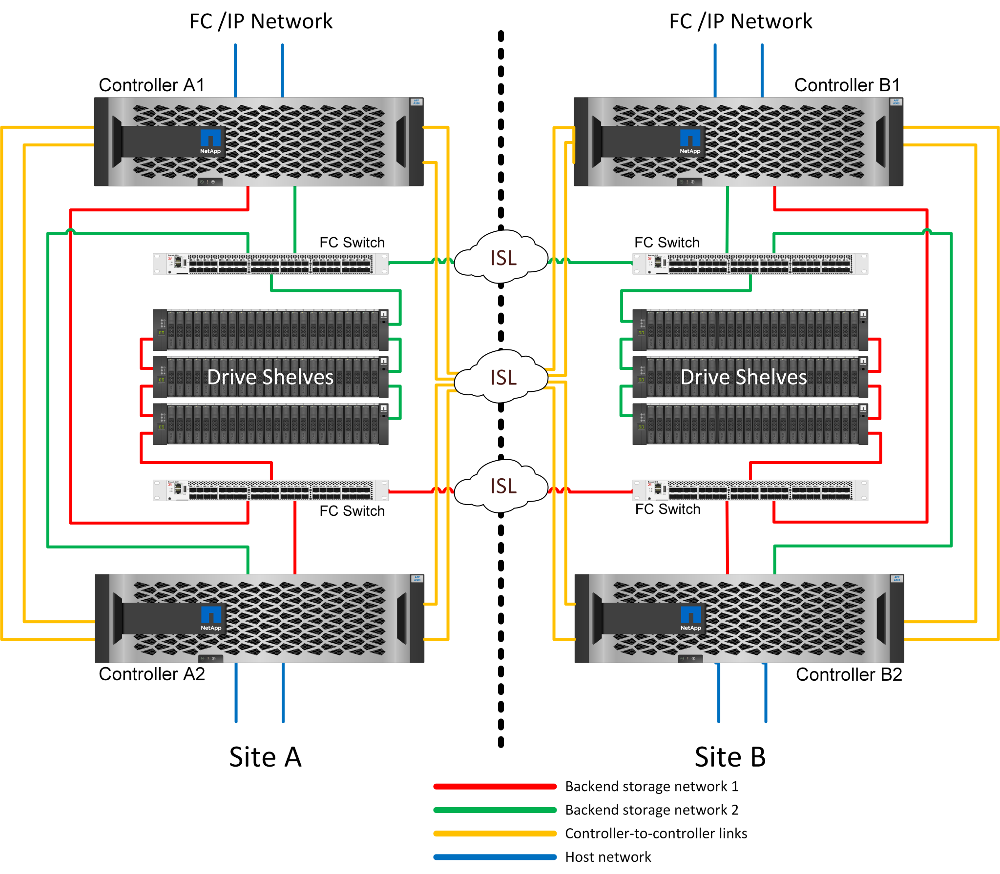

= MetroCluster 可在 3 種不同組態中使用
:allow-uri-read: 

== MetroCluster 可在 3 種不同組態中使用

* HA 可與 IP 連線配對
* HA 可與 FC 連線配對
* 單一控制器、具備 FC 連線能力

NOTE: 術語「連線」是指用於跨站台複寫的叢集連線。它並不指主機協定。無論叢集間通訊所使用的連線類型為何、 MetroCluster 組態中的所有主機端通訊協定都會如常支援。

== 知識產權MetroCluster

HA 配對 MetroCluster IP 組態每個站台使用兩或四個節點。此組態選項可增加與雙節點選項相關的複雜度和成本、但它提供重要的優點：站台內備援。簡單的控制器故障不需要透過 WAN 存取資料。透過替代本機控制器、資料存取仍保持在本機狀態。

大多數客戶都選擇 IP 連線、因為基礎架構需求較為簡單。過去、高速跨站台連線通常較容易使用深色光纖和 FC 交換器進行配置、但如今、高速、低延遲的 IP 電路更容易使用。

由於唯一的跨站台連線適用於控制器、因此架構也更簡單。在 FC SAN 附加 MetroCluster 中、控制器會直接寫入另一個站台上的磁碟機、因此需要額外的 SAN 連線、交換器和橋接器。相反地、 IP 組態中的控制器會透過控制器寫入相對的磁碟機。

如需其他資訊、請參閱 ONTAP 正式文件和 https://www.netapp.com/pdf.html?item=/media/13481-tr4689.pdf["SIP解決方案架構與設計MetroCluster"^]。

== HA 配對 FC SAN 附加 MetroCluster

HA 配對 MetroCluster FC 組態每個站台使用兩個或四個節點。此組態選項可增加與雙節點選項相關的複雜度和成本、但它提供重要的優點：站台內備援。簡單的控制器故障不需要透過 WAN 存取資料。透過替代本機控制器、資料存取仍保持在本機狀態。

有些多站台基礎架構並非設計用於主動式作業、而是更多用於主要站台和災難恢復站台。在這種情況下、 HA 配對 MetroCluster 選項通常較為理想、原因如下：

* 雖然雙節點 MetroCluster 叢集是 HA 系統、但控制器意外故障或規劃的維護作業需要資料服務必須在相反的站台上線。如果站台之間的網路連線能力不支援所需的頻寬、效能就會受到影響。唯一的選項是將各種主機作業系統和相關服務容錯移轉至替代站台。HA 配對 MetroCluster 叢集可消除此問題、因為遺失控制器會導致同一個站台內的簡單容錯移轉。
* 有些網路拓撲並非設計用於跨站台存取、而是使用不同的子網路或隔離的 FC SAN 。在這種情況下、雙節點 MetroCluster 叢集不再作為 HA 系統運作、因為替代控制器無法將資料提供給位於相反站台的伺服器。HA 配對 MetroCluster 選項是提供完整備援的必要條件。
* 如果將雙站台基礎架構視為單一的高可用度基礎架構、則雙節點 MetroCluster 組態很適合。不過、如果系統在站台故障後必須長時間運作、則最好使用 HA 配對、因為它會繼續在單一站台內提供 HA 。

== 雙節點 FC SAN 附加 MetroCluster

雙節點 MetroCluster 組態每個站台僅使用一個節點。此設計比 HA 配對選項簡單、因為要設定和維護的元件較少。此外、它也降低了佈線和 FC 交換方面的基礎架構需求。最後、它能降低成本。

image:../media/mcc-2-node.png["雙節點 MetroCluster"]

這項設計的明顯影響是、控制器在單一站台上故障、表示資料可從另一個站台取得。這種限制不一定是個問題。許多企業都有多站台資料中心作業、並有延伸、高速、低延遲的網路、基本上是一個基礎架構。在這些情況下、 MetroCluster 的雙節點版本是慣用的組態。多家服務供應商目前以 PB 規模使用雙節點系統。

== MetroCluster 恢復功能

MetroCluster 解決方案沒有單點故障：

* 每個控制器都有兩條通往本機站台磁碟櫃的路徑。
* 每個控制器都有兩條通往遠端站台磁碟機櫃的路徑。
* 每個控制器都有兩條通往另一個站台上控制器的路徑。
* 在 HA 配對組態中、每個控制器都有兩條路徑通往本機合作夥伴。

總而言之、您可以移除組態中的任何一個元件、而不會影響 MetroCluster 提供資料的能力。這兩個選項之間恢復能力的唯一差異是 HA 配對版本在站台故障後仍是整個 HA 儲存系統。
