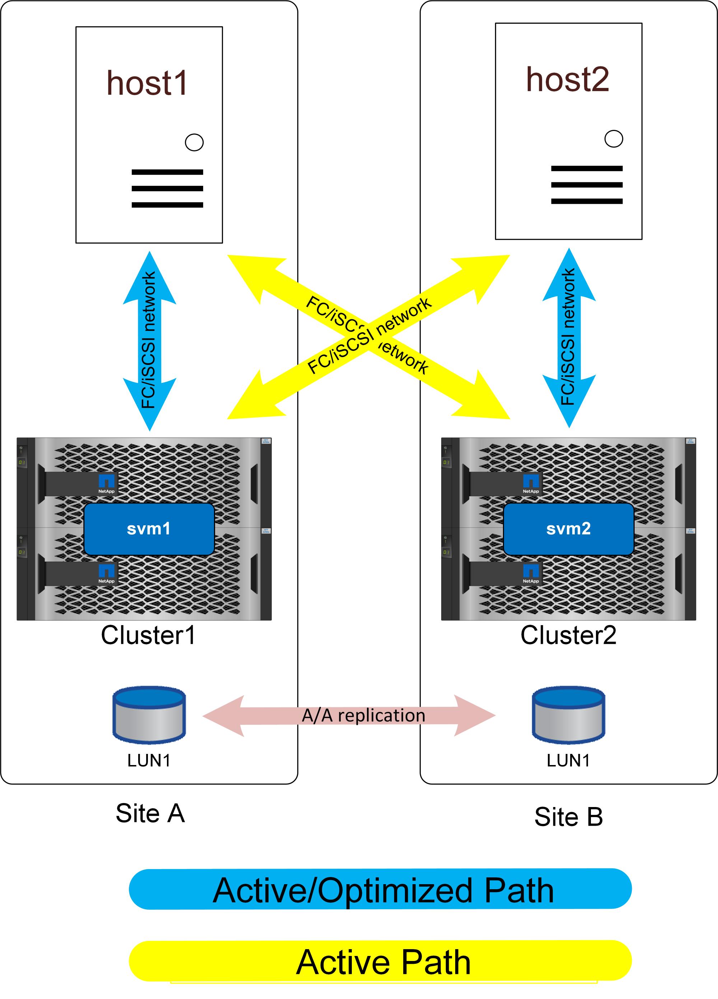
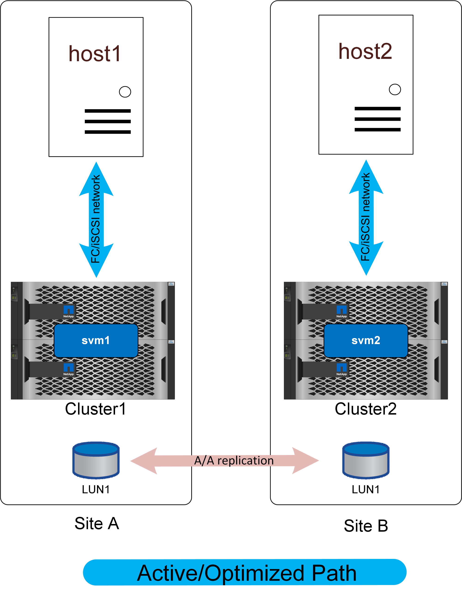

= 特殊警示點設定
:allow-uri-read: 

SM － as 的一項重要功能是能夠設定儲存系統、以瞭解主機的位置。將 LUN 對應至指定主機時、您可以指出 LUN 是否接近指定的儲存系統。

== 特殊警示點設定

特殊警示是指每個叢集的組態、表示特定主機 WWN 或 iSCSI 啟動器 ID 屬於本機主機。這是設定 LUN 存取的第二個選用步驟。

第一步是一般的 igroup 組態。每個 LUN 都必須對應至包含需要存取該 LUN 之主機的 WWN/iSCSI ID 的 igroup 。這會控制哪些主機擁有對 LUN 的 _access_ 。

第二個選用步驟是設定主機鄰近度。這無法控制存取、而是控制 _priority_ 。

例如、站台 A 的主機可能設定為存取受 SnapMirror 主動式同步保護的 LUN 、而且由於 SAN 延伸至站台、因此該 LUN 可使用站台 A 上的儲存設備或站台 B 上的儲存設備來存取路徑

如果沒有特殊警示點設定、則該主機會同時使用兩個儲存系統、因為這兩個儲存系統都會通告主動 / 最佳化的路徑。如果站台之間的 SAN 延遲和 / 或頻寬受到限制、這可能無法進行設計、您可能希望確保在正常作業期間、每個主機都優先使用本機儲存系統的路徑。這是透過將主機 WWN/iSCSI ID 新增至本機叢集做為近端主機來設定的。這可以在 CLI 或 SystemManager 上完成。

== AFF

在 AFF 系統中、設定主機鄰近時、路徑會如下所示。

在正常作業中、所有 IO 都是本機 IO 。從本機儲存陣列提供讀取和寫入服務。寫入 IO 當然也需要由本機控制器複寫到遠端系統、然後才會被確認、但所有讀取 IO 都會在本機上提供服務、而且不會因在站台之間瀏覽 SAN 連結而產生額外延遲。

只有當所有主動 / 最佳化路徑都遺失時、才會使用非最佳化路徑。例如、如果站台 A 上的整個陣列失去電力、站台 A 的主機仍能存取站台 B 上陣列的路徑、因此仍可繼續運作、雖然延遲會較高。

由於簡單起見、本機叢集有多個備援路徑未顯示在這些圖表中。ONTAP 儲存系統本身就是 HA 、因此控制器故障不應導致站台故障。只會導致受影響網站上使用本機路徑的變更。

== ASA

NetApp ASA 系統可跨叢集上的所有路徑提供雙主動式多重路徑。這也適用於 SM-AS 組態。

具有非統一存取權的 ASA 組態、其運作方式與 AFF 大致相同。透過統一存取、 IO 就能跨越 WAN 。這可能是或不理想的做法。

如果兩個站台相距 100 公尺、且具備光纖連線能力、則不應偵測到透過 WAN 的額外延遲、但如果站台相距很遠、則兩個站台的讀取效能都會受到影響。與此相反、 AFF 只有在沒有可用的本機路徑時、才會使用這些 WAN 路徑、而且因為所有 IO 都是本機 IO 、所以日常效能會更好。使用非統一存取網路的 ASA 可讓您選擇取得 ASA 的成本和功能效益、而不會造成跨站台延遲存取的損失。

採用低延遲組態的 ASA 具有兩項有趣的優點。首先、它基本上是 * 任何單一主機的效能加倍 * 、因為 IO 可以由兩倍多的控制器使用兩倍的路徑來提供服務。其次、在單一站台環境中、它提供極高的可用度、因為整個儲存系統可能會遺失、而不會中斷主機存取。
