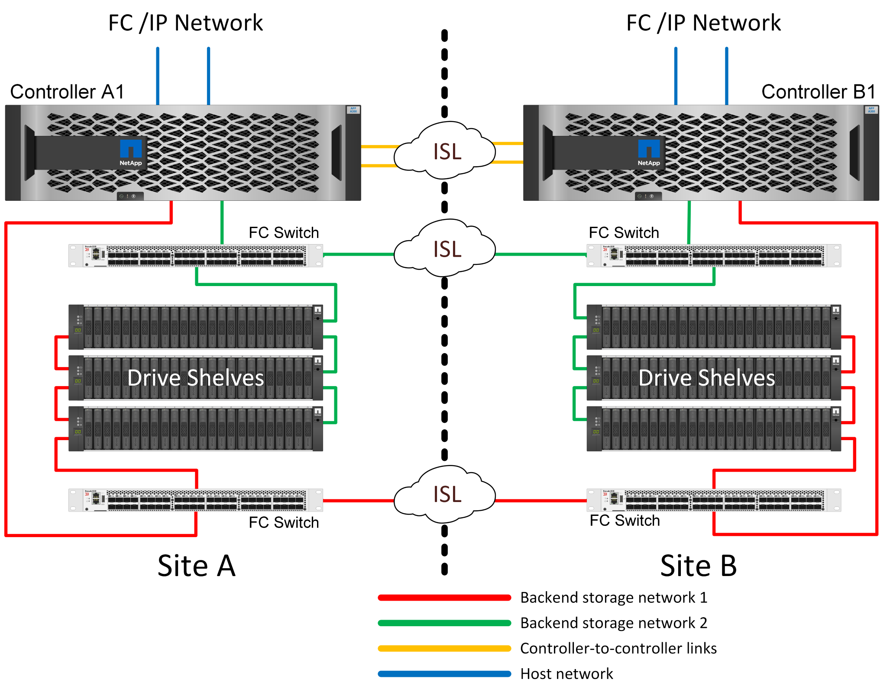

= 架構
:hardbreaks:
:allow-uri-read: 
:icons: font
:linkattrs: 
:imagesdir: ../media/

[role="lead"]
Microsoft SQL Server 部署搭配 MetroCluster 環境需要對 MetroCluster 系統的實體設計進行一些說明。

MetroCluster 會同步鏡射不同位置或故障網域中兩個 ONTAP 叢集之間的資料和組態。MetroCluster 會自動管理兩個目標、為應用程式提供持續可用的儲存空間：

* 透過同步鏡射寫入叢集的資料、將還原點目標（ RPO ）歸零。
* 鏡射組態並自動化第二個站台的資料存取、讓還原時間目標（ RTO ）接近零。

MetroCluster 可在兩個站台的兩個不同叢集之間自動鏡射資料和組態、提供簡易性。在一個叢集內配置儲存設備時、會自動鏡射到第二個站台的第二個叢集。NetApp SyncMirror ® 以零 RPO 提供所有資料的完整複本。這表示來自單一站台的工作負載可隨時切換至另一站台、並持續提供資料而不會遺失資料。MetroCluster 可管理切換程序、以便在第二個站台存取 NAS 和 SAN 資源配置的資料。MetroCluster 的驗證解決方案設計包含規模調整和組態、可在通訊協定逾時期間或更快（通常少於 120 秒）內執行轉換。這會導致接近零的 RPO 、應用程式可以繼續存取資料而不會發生故障。 MetroCluster 有多種由後端儲存架構定義的變化。

== MetroCluster 可在 3 種不同組態中使用

* HA 可與 IP 連線配對
* HA 可與 FC 連線配對
* 單一控制器、具備 FC 連線能力

NOTE: 術語「連線」是指用於跨站台複寫的叢集連線。它並不指主機協定。無論叢集間通訊所使用的連線類型為何、 MetroCluster 組態中的所有主機端通訊協定都會如常支援。

== 知識產權MetroCluster

HA 配對 MetroCluster IP 組態每個站台使用兩或四個節點。此組態選項可增加與雙節點選項相關的複雜度和成本、但它提供重要的優點：站台內備援。簡單的控制器故障不需要透過 WAN 存取資料。透過替代本機控制器、資料存取仍保持在本機狀態。

大多數客戶都選擇 IP 連線、因為基礎架構需求較為簡單。過去、高速跨站台連線通常較容易使用深色光纖和 FC 交換器進行配置、但如今、高速、低延遲的 IP 電路更容易使用。

由於唯一的跨站台連線適用於控制器、因此架構也更簡單。在 FC SAN 附加 MetroCluster 中、控制器會直接寫入另一個站台上的磁碟機、因此需要額外的 SAN 連線、交換器和橋接器。相反地、 IP 組態中的控制器會透過控制器寫入相對的磁碟機。

如需其他資訊、請參閱 ONTAP 正式文件和 https://www.netapp.com/pdf.html?item=/media/13481-tr4689.pdf["SIP解決方案架構與設計MetroCluster"^]。

image:../media/mccip.png["MetroCluster IP 架構"]

== HA 配對 FC SAN 附加 MetroCluster

HA 配對 MetroCluster FC 組態每個站台使用兩個或四個節點。此組態選項可增加與雙節點選項相關的複雜度和成本、但它提供重要的優點：站台內備援。簡單的控制器故障不需要透過 WAN 存取資料。透過替代本機控制器、資料存取仍保持在本機狀態。

image:../media/mcc-4-node.png["四節點 MetroCluster"]

有些多站台基礎架構並非設計用於主動式作業、而是更多用於主要站台和災難恢復站台。在這種情況下、 HA 配對 MetroCluster 選項通常較為理想、原因如下：

* 雖然雙節點 MetroCluster 叢集是 HA 系統、但控制器意外故障或規劃的維護作業需要資料服務必須在相反的站台上線。如果站台之間的網路連線能力不支援所需的頻寬、效能就會受到影響。唯一的選項是將各種主機作業系統和相關服務容錯移轉至替代站台。HA 配對 MetroCluster 叢集可消除此問題、因為遺失控制器會導致同一個站台內的簡單容錯移轉。
* 有些網路拓撲並非設計用於跨站台存取、而是使用不同的子網路或隔離的 FC SAN 。在這種情況下、雙節點 MetroCluster 叢集不再作為 HA 系統運作、因為替代控制器無法將資料提供給位於相反站台的伺服器。HA 配對 MetroCluster 選項是提供完整備援的必要條件。
* 如果將雙站台基礎架構視為單一的高可用度基礎架構、則雙節點 MetroCluster 組態很適合。不過、如果系統在站台故障後必須長時間運作、則最好使用 HA 配對、因為它會繼續在單一站台內提供 HA 。

== 雙節點 FC SAN 附加 MetroCluster

雙節點 MetroCluster 組態每個站台僅使用一個節點。此設計比 HA 配對選項簡單、因為要設定和維護的元件較少。此外、它也降低了佈線和 FC 交換方面的基礎架構需求。最後、它能降低成本。

這項設計的明顯影響是、控制器在單一站台上故障、表示資料可從另一個站台取得。這種限制不一定是個問題。許多企業都有多站台資料中心作業、並有延伸、高速、低延遲的網路、基本上是一個基礎架構。在這些情況下、 MetroCluster 的雙節點版本是慣用的組態。多家服務供應商目前以 PB 規模使用雙節點系統。

== MetroCluster 恢復功能

MetroCluster 解決方案沒有單點故障：

* 每個控制器都有兩條通往本機站台磁碟櫃的路徑。
* 每個控制器都有兩條通往遠端站台磁碟機櫃的路徑。
* 每個控制器都有兩條通往另一個站台上控制器的路徑。
* 在 HA 配對組態中、每個控制器都有兩條路徑通往本機合作夥伴。

總而言之、您可以移除組態中的任何一個元件、而不會影響 MetroCluster 提供資料的能力。這兩個選項之間恢復能力的唯一差異是 HA 配對版本在站台故障後仍是整個 HA 儲存系統。

== SyncMirror

使用 MetroCluster 保護 SQL Server 是以 SyncMirror 為基礎、提供最高效能的橫向擴充同步鏡射技術。

== 使用 SyncMirror 保護資料

在最簡單的層級上、同步複寫表示必須先對鏡射儲存設備的兩側進行任何變更、然後才會被確認。例如、如果資料庫正在寫入記錄檔、或是正在修補 VMware 來賓作業系統、則寫入作業絕不能遺失。作爲一種協議級別，在兩個站點上的非易失性介質被認可之前，存儲系統不得確認寫入內容。只有這樣、在不遺失資料的風險下繼續作業是安全的。

使用同步複寫技術是設計和管理同步複寫解決方案的第一步。最重要的考量是瞭解在各種計畫性和非計畫性失敗案例中可能發生的情況。並非所有同步複寫解決方案都提供相同的功能。如果您需要提供零恢復點目標（ RPO ）的解決方案、亦即零資料遺失、則必須考慮所有故障情況。特別是、當站台之間的連線中斷而無法進行複寫時、預期會產生什麼結果？

== SyncMirror 資料可用度

MetroCluster 複寫是以 NetApp SyncMirror 技術為基礎、其設計旨在有效率地切換至同步模式及從同步模式切換到同步模式。這項功能符合要求同步複寫、但也需要高可用度資料服務的客戶需求。例如、如果中斷與遠端站台的連線、通常最好讓儲存系統繼續以非複寫狀態運作。

許多同步複寫解決方案只能以同步模式運作。這種類型的全或全無複寫有時稱為 Domino 模式。這類儲存系統會停止提供資料、而不允許資料的本機和遠端複本進行非同步處理。如果複寫被強制中斷、重新同步可能會非常耗時、而且可能會讓客戶在重新建立鏡像期間暴露在完全資料遺失的風險中。

SyncMirror 不僅可以在無法連線到遠端站台時、無縫切換至同步模式、也可以在連線恢復時、快速重新同步至 RPO = 0 狀態。遠端站台的資料過時複本也可在重新同步期間保留為可用狀態、以確保資料的本機和遠端複本隨時都存在。

在需要 Domino 模式的情況下、 NetApp 提供 SnapMirror 同步（ SM-S ）。應用程式層級選項也存在、例如 Oracle DataGuard 或 SQL Server Always On Availability Groups 。作業系統層級的磁碟鏡射可以是一個選項。如需其他資訊和選項、請洽詢您的 NetApp 或合作夥伴客戶團隊。
