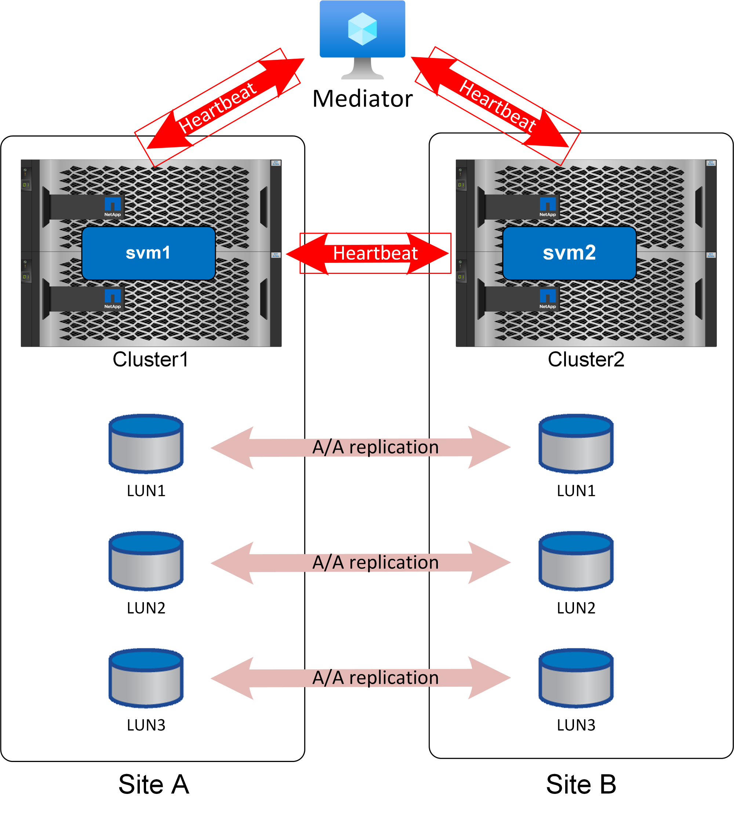

= 中間器ONTAP
:hardbreaks:
:allow-uri-read: 
:icons: font
:linkattrs: 
:imagesdir: ../media/

[role="lead"]
安全地自動化容錯移轉需要 Mediator 。理想情況下、它會放置在獨立的第三站台、但如果與參與複寫的叢集之一共存、則仍能滿足大多數需求。

調解器並不是真正的斷路器、但這實際上正是它所提供的功能。它不會採取任何行動、而是提供替代的通訊通道、讓叢集與叢集之間能進行通訊。

自動化容錯移轉的第一項挑戰是大腦分離問題、如果兩個站台彼此之間的連線中斷、就會發生這個問題。應該發生什麼事？您不想讓兩個不同的網站自行指定為資料的保存複本、但如何讓單一網站分辨相對網站的實際損失與無法與相對網站通訊的差異？

這是調解者輸入圖片的地方。如果放置在第三個站台上、而且每個站台都有與該站台的個別網路連線、則每個站台都有額外的路徑來驗證對方的健全狀況。請再次查看上圖、並思考下列案例。

* 如果調解器故障或無法從一個或兩個站台連線、會發生什麼情況？
+
** 這兩個叢集仍可透過複寫服務所使用的相同連結彼此通訊。
** 資料仍以 RPO = 0 保護提供

* 如果站台 A 故障會發生什麼情況？
+
** 站台 B 會看到兩個通訊通道都中斷。
** 站台 B 將接管資料服務、但不使用 RPO=0 鏡射

* 如果站台 B 故障會發生什麼情況？
+
** 站台 A 會看到兩個通訊通道都中斷。
** 站台 A 會接管資料服務、但不會使用 RPO=0 鏡射

還有一個案例需要考量：資料複寫連結遺失。如果站台之間的複寫連結遺失、 RPO=0 鏡射顯然是不可能的。那麼應該發生什麼事？

這是由偏好的站台狀態所控制。在 SM 合夥關係中、其中一個站台是次要站台。這對正常作業沒有影響、所有資料存取都是對稱的、但如果複寫中斷、則必須中斷連結才能恢復作業。結果是首選站台將在不進行鏡射的情況下繼續作業、而次要站台將停止 IO 處理、直到複寫通訊恢復為止。
