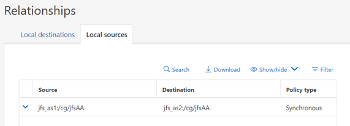

= 偏好的網站
:allow-uri-read: 
:imagesdir: ../media/

[role="lead"]
SnapMirror 主動式同步處理行為是對稱的、但有一個重要的例外是偏好的站台組態。

SnapMirror 作用中同步將一個站台視為「來源」、另一個則視為「目的地」。這表示單向複寫關係、但這不適用於 IO 行為。複寫是雙向的、對稱的、而且在鏡像的兩側、 IO 回應時間相同。

 `source`指定是控制偏好的站台。如果複寫連結遺失、來源複本上的 LUN 路徑將繼續提供資料、而目的地複本上的 LUN 路徑將無法使用、直到 SnapMirror 重新建立複寫並重新進入同步狀態為止。然後路徑將恢復服務資料。

來源 / 目的地組態可透過 SystemManager 檢視：

或在 CLI ：

....
Cluster2::> snapmirror show -destination-path jfs_as2:/cg/jfsAA

                            Source Path: jfs_as1:/cg/jfsAA
                       Destination Path: jfs_as2:/cg/jfsAA
                      Relationship Type: XDP
                Relationship Group Type: consistencygroup
                    SnapMirror Schedule: -
                 SnapMirror Policy Type: automated-failover-duplex
                      SnapMirror Policy: AutomatedFailOverDuplex
                            Tries Limit: -
                      Throttle (KB/sec): -
                           Mirror State: Snapmirrored
                    Relationship Status: InSync
....
關鍵在於來源為叢集 1 上的 SVM 。如上所述、「來源」和「目的地」兩詞並未說明複寫資料的流程。這兩個站台都可以處理寫入作業、並將其複寫到另一個站台。實際上、兩個叢集都是來源和目的地。將一個叢集指定為來源的效果、只是控制在複寫連結遺失時、哪個叢集仍保留為讀寫儲存系統。
