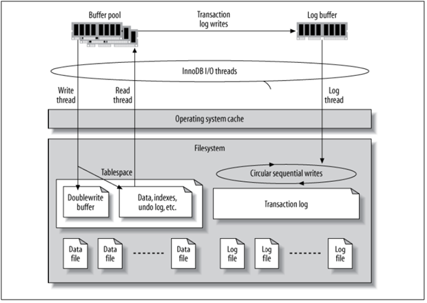

= 檔案結構
:allow-uri-read: 
:icons: font
:imagesdir: ../media/

[role="lead"]
InnoDB 是儲存設備和 MySQL 伺服器之間的中間層、可將資料儲存到磁碟機中。

MySQL I/O 分為兩種類型：

* 隨機檔案 I/O
* 連續檔案 I/O

image:../media/mysql-file-structure2.png["I/O 類型"]

資料檔案會隨機讀取及覆寫、因此 IOPS 較高。因此、建議使用 SSD 儲存設備。

重做記錄檔和二進位記錄檔是交易記錄檔。它們會依序寫入、因此您可以在 HDD 上使用寫入快取獲得良好效能。恢復時會進行連續讀取、但很少會造成效能問題、因為記錄檔大小通常比資料檔案小、而連續讀取比隨機讀取快（發生在資料檔案上）。

雙寫入緩衝區是 InnoDB 的一項特殊功能。InnoDB 會先將排清的頁面寫入雙寫入緩衝區、然後將頁面寫入資料檔案的正確位置。此程序可防止頁面毀損。如果沒有雙寫入緩衝區、如果在寫入磁碟機程序期間發生電源故障、頁面可能會毀損。由於寫入雙寫入緩衝區是循序的、因此對 HDD 進行了高度最佳化。恢復時會進行連續讀取。

由於 ONTAP NVRAM 已提供寫入保護、因此不需要雙重寫入緩衝。MySQL 有一個參數、 `skip_innodb_doublewrite`，以停用雙寫入緩衝區。此功能可大幅提升效能。

插入緩衝區也是 InnoDB 的一項特殊功能。如果非唯一的次要索引區塊不在記憶體中、 InnoDB 會將項目插入插入插入緩衝區、以避免隨機 I/O 作業。插入緩衝區會定期合併到資料庫的次要索引樹中。插入緩衝區可將 I/O 要求合併至同一個區塊、以減少 I/O 作業的數量；隨機 I/O 作業可以是連續的。插入緩衝區也針對 HDD 進行了高度最佳化。連續寫入和讀取都會在正常作業期間執行。

復原區段以隨機 I/O 為導向。為了保證多重版本併發（ MVCC ）、 InnoDB 必須在復原區段中登錄舊影像。從復原區段讀取先前影像需要隨機讀取。如果您執行具有可重複讀取的長交易（例如 mysqldump —單一交易）或執行長查詢、可能會發生隨機讀取。因此、在這種情況下、將復原區段儲存在 SSD 上會更好。如果您只執行簡短的交易或查詢、隨機讀取並不是問題。

[TIP]
====
* 由於 InnoDB I/O 特性、 NetApp 建議 * 下列儲存設計配置。

* 一個用於儲存 MySQL 的隨機和連續 I/O 導向檔案的磁碟區
* 另一個用於儲存 MySQL 純粹循序 I/O 導向檔案的磁碟區

此配置也能協助您設計資料保護原則與策略。

====