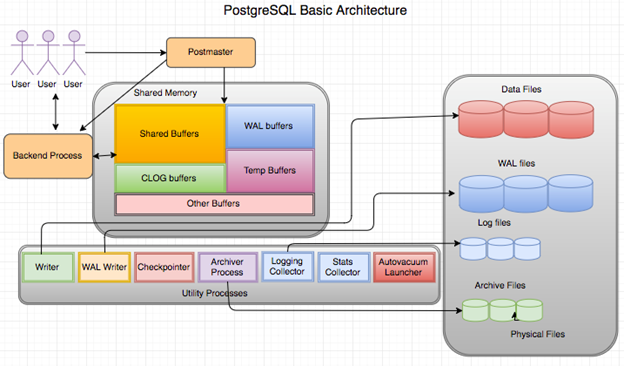

= PostgreSQL 架構
:allow-uri-read: 

[role="lead"]
PostgreSQL 是以用戶端和伺服器架構為基礎的 RDBMS 。PostgreSQL 執行個體稱為資料庫叢集、是資料庫的集合、而非伺服器集合。

PostgreSQL 資料庫中有三個主要元素：郵政局長、前端（用戶端）和後端用戶端會傳送要求給郵政局長、其中包含 IP 傳輸協定等資訊、以及要連線的資料庫。郵政局長會驗證連線、並將其傳送至後端程序以進行進一步的通訊。後端程序會執行查詢、並將結果直接傳送至前端（用戶端）。

PostgreSQL 執行個體是以多重處理模式為基礎、而非多重執行緒模式。它會為不同的工作產生多個處理程序、而且每個處理程序都有自己的功能。主要程序包括用戶端程序、 Wal 寫入程序、背景寫入程序及檢查指標程序：

* 當用戶端（前景）程序傳送讀取或寫入要求至 PostgreSQL 執行個體時、它不會直接讀取或寫入資料至磁碟。它首先緩衝共享緩衝區和預先寫入記錄（ Wal ）緩衝區中的資料。
* Wal 寫入器程序會操控共用緩衝區和 Wal 緩衝區的內容、以寫入 Wal 記錄檔。Wal 記錄檔通常是 PostgreSQL 的交易記錄檔、並依序寫入。因此、為了改善資料庫的回應時間、 PostgreSQL 會先寫入交易記錄檔、並確認用戶端。
* 若要將資料庫置於一致的狀態、背景寫入器程序會定期檢查共用緩衝區是否有髒頁。然後將資料排清至儲存在 NetApp 磁碟區或 LUN 上的資料檔案。
* checkpointer 程序也會定期執行（比背景程序更少）、並防止對緩衝區進行任何修改。它會向 Wal 寫入器程序發出訊號、將檢查點記錄寫入並清除至儲存在 NetApp 磁碟上的 Wal 記錄檔結尾。它也會向背景寫入器程序發出訊號、要求將所有髒頁寫入磁碟並清除。

