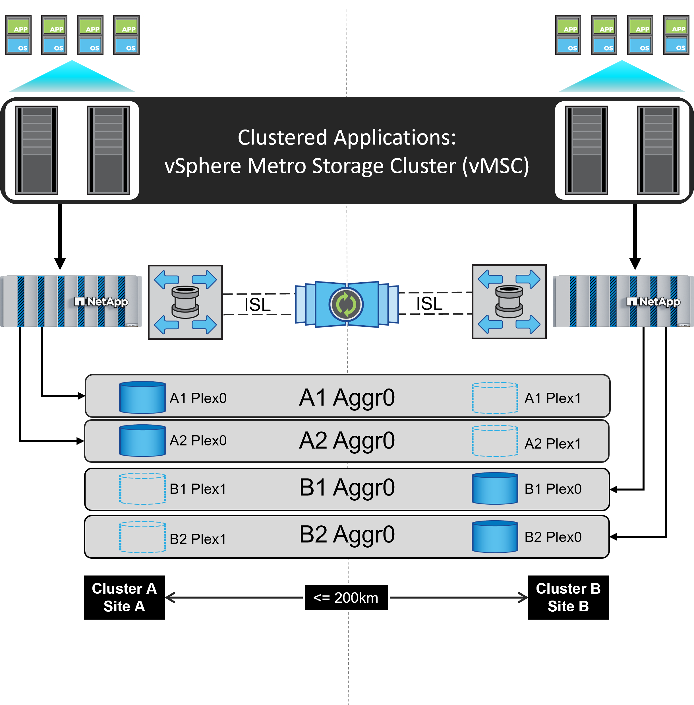
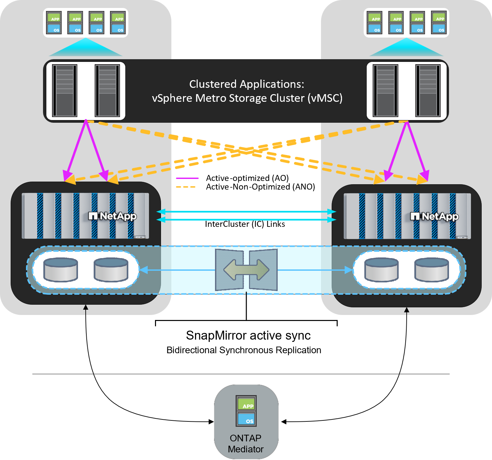

= vSphere Metro Storage 叢集搭配 ONTAP
:hardbreaks:
:allow-uri-read: 
:nofooter: 
:icons: font
:linkattrs: 
:imagesdir: ../media/

[role="lead"]
VMware 領先業界的 vSphere Hypervisor 可部署為稱為 vSphere Metro Storage Cluster （ VMSC ）的延伸叢集。

NetApp ® MetroCluster ™和 SnapMirror 主動同步（以前稱爲 SnapMirror 業務連續性或 SMBC ）均支持 VMSC 解決方案，如果一個或多個故障域發生整體中斷，則可提供高級業務連續性。不同故障模式的恢復能力取決於您選擇的組態選項。

NOTE: 本文件取代先前發佈的技術報告 _TR-4128 ： NetApp MetroCluster 上的 vSphere

== 適用於 vSphere 環境的持續可用度解決方案

ONTAP 架構是靈活且可擴充的儲存平台、可為資料存放區提供 SAN （ FCP 、 iSCSI 和 NVMe of ）和 NAS （ NFS v3 和 v4.1 ）服務。NetApp AFF 、 ASA 和 FAS 儲存系統使用 ONTAP 作業系統來提供額外的通訊協定、以供 S3 和 SMB/CIFS 等來賓儲存設備存取。

NetApp MetroCluster 使用 NetApp 的 HA （控制器容錯移轉或 CFO ）功能來防範控制器故障。它也包括本機 SyncMirror 技術，災難時的叢集容錯移轉（災難時的叢集容錯移轉或 CFOD ），硬體備援，以及地理區隔，以達到高可用度。SyncMirror 會將資料寫入兩個叢中、以同步鏡射 MetroCluster 組態的兩個部份資料：本機叢（位於本機櫃上）主動提供資料、而遠端叢（位於遠端機櫃上）通常不會提供資料。所有 MetroCluster 元件（例如控制器、儲存設備、纜線、交換器（與 Fabric MetroCluster 搭配使用）和介面卡）均具備硬體備援功能。

NetApp SnapMirror 主動式同步可在非 MetroCluster 系統和 ASA R2 系統上使用，透過 FCP 和 iSCSI SAN 傳輸協定提供資料存放區精細保護。它可讓您保護整個 VMSC ，或選擇性地保護高優先順序工作負載。它提供對本機和遠端站台的主動式存取、而 NetApp MetroCluster 則是主動式待命解決方案。從 ONTAP 9.15.1 開始， SnapMirror 主動式同步支援對稱式主動 / 主動式功能，可從受保護 LUN 的兩個複本進行讀取和寫入 I/O 作業，並提供雙向同步複寫功能，讓兩個 LUN 複本都能在本機執行 I/O 作業。在 ONTAP 9.15.1 之前， SnapMirror 主動式同步僅支援非對稱式主動 / 主動式組態，其中次要站台上的資料會代理至 LUN 的主要複本。

若要跨兩個站台建立 VMware HA/DRS 叢集、 ESXi 主機會由 vCenter Server Appliance （ VCSA ）使用和管理。vSphere 管理、 VMotion ® 和虛擬機器網路是透過兩個站台之間的備援網路連線。管理 HA/DRS 叢集的 vCenter Server 可連線至兩個站台的 ESXi 主機、並應使用 vCenter HA 進行設定。

請參閱 https://docs.vmware.com/en/VMware-vSphere/8.0/vsphere-vcenter-esxi-management/GUID-F7818000-26E3-4E2A-93D2-FCDCE7114508.html["如何在 vSphere Client 中建立和設定叢集"] 設定 vCenter HA 。

您也應該 https://www.vmware.com/docs/vmw-vmware-vsphere-metro-storage-cluster-recommended-practices["VMware vSphere Metro儲存叢集建議實務做法"]參閱。

== 什麼是 vSphere Metro Storage Cluster ？

vSphere Metro Storage Cluster （ VMSC ）是經過認證的組態、可保護虛擬機器（ VM ）和容器免於故障。這是透過使用延伸儲存概念和 ESXi 主機叢集來達成的、這些主機分佈在不同的故障網域、例如機架、建築物、校園或甚至城市。NetApp MetroCluster 和 SnapMirror 主動式同步儲存技術用於為主機叢集提供零恢復點目標（ RPO = 0 ）保護。VMSC 組態的設計，是為了確保即使完整的實體或邏輯「站台」故障，資料仍可隨時使用。在成功通過 VMSC 認證程序之後、必須通過 VMSC 組態一部分的儲存裝置認證。所有支援的儲存裝置都可以在中找到 https://www.vmware.com/resources/compatibility/search.php["VMware 儲存相容性指南"]。

如果您想要更多有關 vSphere Metro Storage 叢集設計準則的資訊、請參閱下列文件：

* https://kb.vmware.com/s/article/2031038["VMware vSphere 支援 NetApp MetroCluster"]
* https://kb.vmware.com/s/article/83370["VMware vSphere 支援 NetApp SnapMirror 業務持續運作"] （現在稱為 SnapMirror 主動同步）

NetApp MetroCluster 可部署在兩種不同的組態中，以搭配 vSphere 使用：

* Stretch MetroCluster
* Fabric MetroCluster

以下說明 Stretch MetroCluster 的高階拓撲圖。

請參閱 https://www.netapp.com/support-and-training/documentation/metrocluster/["本文檔MetroCluster"] 取得 MetroCluster 的特定設計與部署資訊。

SnapMirror 主動式同步也可透過兩種不同方式部署。

* 非對稱
* 對稱 Active Sync （ ONTAP 9.15.1 ）

如需 SnapMirror 主動式同步的特定設計與部署資訊，請參閱 https://docs.netapp.com/us-en/ontap/smbc/index.html["NetApp文件"]。
